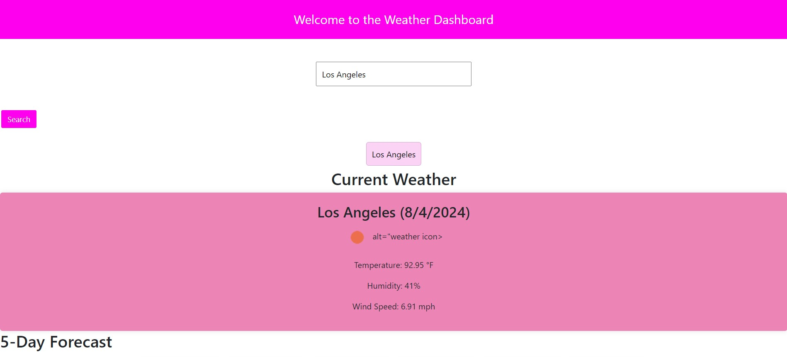
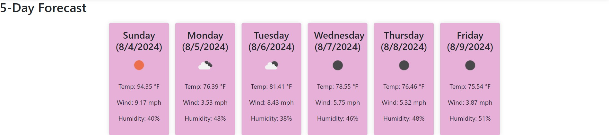

# weather-dashboard

## Description
A weather dashboard where you can search a city, then be presented with a current forecast and a 5-day weather forecast. Weather forecasts include Location, Temperature (farenheit), Humidity, and Wind Speed.

## Technologies Used
HTML, CSS, JavaScript, OpenWeatherMap API, jQuery, and Bootstrap.

## Installation
1. Clone the repository
git clone https://github.com/yourusername/weather-dashboard.git

2. cd into the project

3. Open the index.html in your preferred browser

## Usage
1. Search for a city by entering the name of the city in the search bar. Then click the search button.
2. View the current weather and the 5-day weather forecast
3. View search history by clicking on the city that has been previosly searched.

NOTE: You will need your own api key for this project. Visit https://openweathermap.org/forecast5 to receive your own api key.

## Contributing
If you would like to contribute to this project, please fork the repository and submit a pull request with any changes.

## License
This project is licensed under the MIT License

## Links
Github: https://github.com/Betzaida96/weather-dashboard
Live site: https://betzaida96.github.io/weather-dashboard/

## Photos

